# Case Study #2 - Pizza Runner 🍕
Reference: [8 Week SQL Challenge - Pizza Runner](https://8weeksqlchallenge.com/case-study-2/)
***
## Introduction
Did you know that over 115 million kilograms of pizza is consumed daily worldwide??? (Well according to Wikipedia anyway…)

Danny was scrolling through his Instagram feed when something really caught his eye - “80s Retro Styling and Pizza Is The Future!”

Danny was sold on the idea, but he knew that pizza alone was not going to help him get seed funding to expand his new Pizza Empire - so he had one more genius idea to combine with it - he was going to Uberize it - and so Pizza Runner was launched!

Danny started by recruiting “runners” to deliver fresh pizza from Pizza Runner Headquarters (otherwise known as Danny’s house) and also maxed out his credit card to pay freelance developers to build a mobile app to accept orders from customers.
***
## Available Data

Because Danny had a few years of experience as a data scientist - he was very aware that data collection was going to be critical for his business’ growth.

He has prepared for us an entity relationship diagram of his database design but requires further assistance to clean his data and apply some basic calculations so he can better direct his runners and optimise Pizza Runner’s operations.

All datasets exist within the pizza_runner database schema - be sure to include this reference within your SQL scripts as you start exploring the data and answering the case study questions.
***
### Entity Relationship Diagram
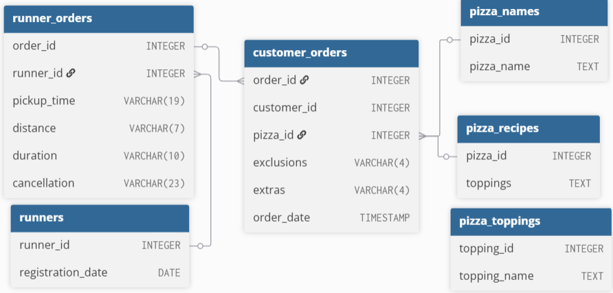
***

## Case Study Questions
This case study has LOTS of questions - they are broken up by area of focus including:

- Pizza Metrics
- Runner and Customer Experience
- Ingredient Optimisation
- Pricing and Ratings
- Bonus DML Challenges (DML = Data Manipulation Language)

Each of the following case study questions can be answered using a single SQL statement.

Again, there are many questions in this case study - please feel free to pick and choose which ones you’d like to try!

Before you start writing your SQL queries however - you might want to investigate the data, you may want to do something with some of those null values and data types in the customer_orders and runner_orders tables!

#### Cleaning runner_orders table
```sql

UPDATE runner_orders
SET 
	pickup_time = CASE WHEN pickup_time = 'null' THEN NULL ELSE pickup_time END,
	distance = CASE WHEN distance = 'null' THEN NULL ELSE distance END,
	duration = CASE WHEN duration = 'null' THEN NULL ELSE duration END,
	cancellation = CASE WHEN cancellation = 'null' OR cancellation = '' THEN NULL ELSE cancellation END;

UPDATE runner_orders
SET 
	distance = TRIM('km' FROM distance),
	duration = TRIM('minutes' FROM duration);

ALTER TABLE runner_orders
ALTER COLUMN distance TYPE FLOAT
USING distance::FLOAT;

ALTER TABLE runner_orders
ALTER COLUMN duration TYPE INTEGER
USING duration::INTEGER;

ALTER TABLE runner_orders
ALTER COLUMN distance TYPE NUMERIC;

```
***
#### Cleaning customer_orders table
```sql

UPDATE customer_orders
SET
	exclusions = CASE WHEN exclusions = '' OR exclusions = 'null' THEN NULL ELSE exclusions END,
	extras = CASE WHEN extras = '' OR extras = 'null' THEN NULL ELSE extras END;

```
***
## A. Pizza Metrics
#### 1. How many pizzas were ordered?
```sql

SELECT COUNT(*) AS pizzas_ordered
FROM customer_orders

```
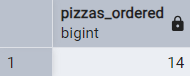
***
#### 2. How many unique customer orders were made??
```sql

SELECT COUNT(DISTINCT customer_id) AS unique_orders
FROM customer_orders;

```
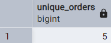
***
#### 3. How many successful orders were delivered by each runner?
```sql

SELECT runner_id, COUNT(*) AS successful_orders
FROM runner_orders
WHERE cancellation ISNULL
GROUP BY runner_id
ORDER BY runner_id;

```
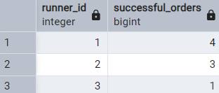
***
#### 4. How many of each type of pizza was delivered?
```sql

SELECT pizza_id, COUNT(*) AS pizza_type_count
FROM customer_orders
JOIN runner_orders
USING (order_id)
WHERE cancellation ISNULL
GROUP BY pizza_id
ORDER BY pizza_id;

```
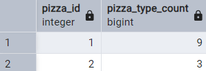
***
#### 5. How many Vegetarian and Meatlovers were ordered by each customer?
```sql

SELECT customer_id, pizza_name, COUNT(pizza_name)
FROM customer_orders
JOIN runner_orders
USING (order_id)
JOIN pizza_names
USING (pizza_id)
GROUP BY customer_id, pizza_name
ORDER BY customer_id;

```
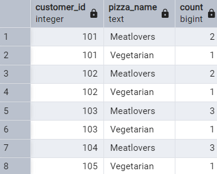
***
#### 6. What was the maximum number of pizzas delivered in a single order?
```sql

SELECT order_id, COUNT(pickup_time) AS pizza_orders
FROM runner_orders
JOIN customer_orders
USING (order_id)
WHERE pickup_time IS NOT NULL
GROUP BY pickup_time, order_id
ORDER BY pizza_orders DESC
LIMIT 1;

```
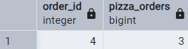
***
#### 7. For each customer, how many delivered pizzas had at least 1 change and how many had no changes?
```sql

SELECT customer_id, COUNT(change) AS pizza_change
FROM (SELECT *,
CASE 
	WHEN exclusions IS NOT NULL OR extras IS NOT NULL THEN 'change'
	ELSE 'no change'
END AS change
FROM customer_orders)
WHERE change = 'change'
GROUP BY customer_id;

```
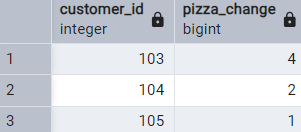
***
#### 8. How many pizzas were delivered that had both exclusions and extras?
```sql

SELECT SUM(pizza_change) AS pizza_both
FROM (SELECT customer_id, COUNT(change) AS pizza_change
FROM (SELECT *,
CASE 
	WHEN exclusions IS NOT NULL AND extras IS NOT NULL THEN 'both'
	ELSE 'no change'
END AS change
FROM customer_orders)
WHERE change = 'both'
GROUP BY customer_id);

```

***
#### 9. What was the total volume of pizzas ordered for each hour of the day?
```sql

SELECT COUNT(order_id) AS count_pizza, hour_of_day
FROM (SELECT order_id, EXTRACT(HOUR FROM order_time::TIMESTAMP) AS hour_of_day
FROM runner_orders
JOIN customer_orders
USING (order_id))
GROUP BY hour_of_day
ORDER BY hour_of_day ASC;

```
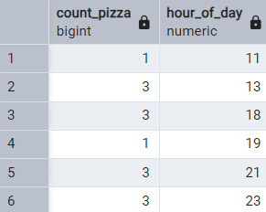
***
#### 10. What was the volume of orders for each day of the week?
```sql

SELECT day_name, day_of_week, COUNT(order_id) AS count_pizza
FROM (SELECT order_id, EXTRACT(DOW FROM order_time::TIMESTAMP) day_of_week, TO_CHAR(order_time::TIMESTAMP, 'FMDay') AS day_name
FROM runner_orders
JOIN customer_orders
USING (order_id))
GROUP BY day_of_week, day_name
ORDER BY day_of_week ASC;
```
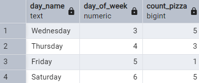
***
## B. Runner and Customer Experience
#### 1. How many runners signed up for each 1 week period? (i.e. week starts 2021-01-01)
```sql

SELECT week_number, COUNT(week_number) AS count_runners_signed
FROM (SELECT
       FLOOR((EXTRACT(DOY FROM registration_date) - 1) / 7) + 1 AS week_number
FROM runners)
GROUP BY week_number
ORDER BY week_number;

```
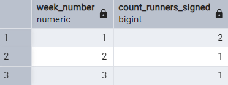
***
#### 2. What was the average time in minutes it took for each runner to arrive at the Pizza Runner HQ to pickup the order?
```sql

SELECT runner_id, 
	ROUND(AVG(EXTRACT(EPOCH FROM (pickup_time::TIMESTAMP - order_time))/60),2) AS minute_to_hq
FROM customer_orders
LEFT JOIN runner_orders
USING (order_id)
WHERE pickup_time IS NOT NULL
GROUP BY runner_id
ORDER BY runner_id;

```
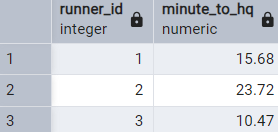
***
#### 3. Is there any relationship between the number of pizzas and how long the order takes to prepare?
```sql

WITH pizza_prep AS (
SELECT order_time, pickup_time,
	COUNT(order_id) AS count_pizza,
	ROUND(AVG(EXTRACT(EPOCH FROM (pickup_time::TIMESTAMP - order_time))/60),2) AS prep_time
FROM (SELECT DISTINCT *
FROM runner_orders
JOIN customer_orders
USING (order_id)
WHERE pickup_time IS NOT NULL)
GROUP BY order_time, pickup_time)

SELECT count_pizza, ROUND(AVG(prep_time), 2) AS avg_pre
FROM pizza_prep
GROUP BY count_pizza
ORDER BY count_pizza;

```
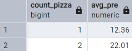
***
#### 4. What was the average distance travelled for each customer?
```sql

SELECT customer_id, CONCAT(ROUND(AVG(distance), 2), ' km') AS avg_distance
FROM customer_cte
GROUP BY customer_id
ORDER BY customer_id;

```
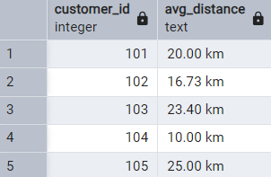
***
#### 5. What was the difference between the longest and shortest delivery times for all orders?
```sql

SELECT MAX(duration) - MIN(duration) AS delivery_time_diff
FROM runner_orders;

```
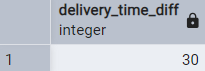
***
#### 6. What was the average speed for each runner for each delivery and do you notice any trend for these values?
```sql

SELECT runner_id, customer_id, CONCAT(ROUND(AVG(distance/duration) * 60, 2),' km/hr') AS avg_speed
FROM customer_cte
GROUP BY runner_id, customer_id
ORDER BY runner_id;

```
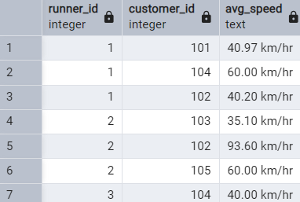
***
#### 7. What is the successful delivery percentage for each runner?
```sql

SELECT runner_id,
CONCAT(100*(COUNT(runner_id) - SUM(CASE
	WHEN duration IS NULL THEN 1
	ELSE 0
END))/COUNT(runner_id), '%') AS success_percentage
FROM customer_cte_null
GROUP BY runner_id
ORDER BY runner_id;

```
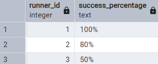
***
## C. Ingredient Optimisation
#### 1. What are the standard ingredients for each pizza?
```sql

SELECT topping_name,
CASE
	WHEN veggie_toppings = meat_toppings THEN 'yes'
	ELSE 'no'
END AS standard_ingredient
FROM pizza_topping_names
WHERE veggie_toppings = meat_toppings;

```
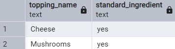
***
#### 2. What was the most commonly added extra?
```sql

WITH count_extra AS (SELECT TRIM(UNNEST(STRING_TO_ARRAY(extras, ',')))::INTEGER AS extra_toppings
FROM customer_orders
WHERE extras IS NOT NULL)

SELECT topping_name, COUNT(extra_toppings) AS extra_topping_count
FROM count_extra
JOIN pizza_topping_names
ON extra_toppings = topping_id
GROUP BY topping_name
ORDER BY extra_topping_count DESC
LIMIT 1;

```

***
#### 3. What was the most common exclusion?
```sql

WITH count_exclusion AS (SELECT TRIM(UNNEST(STRING_TO_ARRAY(exclusions, ',')))::INTEGER AS excluded_toppings
FROM customer_orders
WHERE exclusions IS NOT NULL)

SELECT topping_name, COUNT(excluded_toppings) AS excluded_topping_count
FROM count_exclusion
JOIN pizza_topping_names
ON excluded_toppings = topping_id
GROUP BY topping_name
ORDER BY excluded_topping_count DESC
LIMIT 1;

```

***
#### 4. Generate an order item for each record in the customers_orders table in the format of one of the following:
- Meat Lovers
- Meat Lovers - Exclude Beef
- Meat Lovers - Extra Bacon
- Meat Lovers - Exclude Cheese, Bacon - Extra Mushroom, Peppers
***
#### 5. Generate an alphabetically ordered comma separated ingredient list for each pizza order from the customer_orders table and add a 2x in front of any relevant ingredients
- For example: "Meat Lovers: 2xBacon, Beef, ... , Salami"
***
#### 6. What is the total quantity of each ingredient used in all delivered pizzas sorted by most frequent first
```sql

SELECT ptn.topping_id, 
	   ptn.topping_name, 
	   COALESCE(veggie_count, 0) AS veggie_count,
	   COALESCE(meat_count, 0) AS meat_count,
	   COALESCE(extra_topping_count, 0) AS extra_topping_count,
	   COALESCE(excluded_topping_count, 0) AS excluded_topping_count,
	   COALESCE(veggie_count, 0) + COALESCE(meat_count, 0) + COALESCE(extra_topping_count, 0) - COALESCE(excluded_topping_count, 0) AS total_ingredients_used
FULL JOIN veggie_order_count
USING (topping_id)
FULL JOIN meat_order_count
USING (topping_id)
FULL JOIN extra_toppings_count
USING (topping_id)
FULL JOIN exclusion_toppings_count
USING (topping_id)
ORDER BY total_ingredients_used DESC;

```
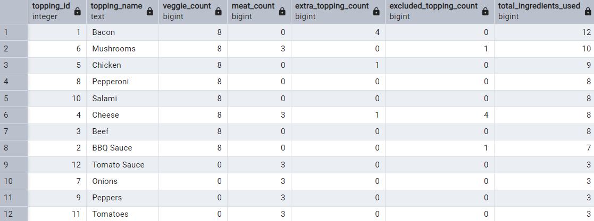
***
## C. Pricing and Ratings
#### 1. If a Meat Lovers pizza costs $12 and Vegetarian costs $10 and there were no charges for changes - how much money has Pizza Runner made so far if there are no delivery fees?
```sql

SELECT '$ ' || SUM(pizza_sales) AS total_sales
FROM(SELECT pizza_name,
CASE
	WHEN pizza_name = 'Meat Lovers' THEN pizza_count * 12
	WHEN pizza_name = 'Vegetarian' THEN pizza_count * 10
	ELSE NULL
END AS pizza_sales
FROM (
SELECT pizza_name, COUNT(*) AS pizza_count
FROM runner_orders
JOIN customer_orders
USING (order_id)
JOIN pizza_names
USING (pizza_id)
WHERE pickup_time IS NOT NULL
GROUP BY pizza_name
));

```
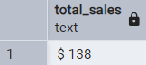
***
#### 2. What if there was an additional $1 charge for any pizza extras?
```sql

WITH pizza_count AS (
SELECT pizza_name, COUNT(*) AS pizza_count
FROM runner_orders
JOIN customer_orders
USING (order_id)
JOIN pizza_names
USING (pizza_id)
WHERE pickup_time IS NOT NULL
GROUP BY pizza_name
),
extras_count AS (
SELECT pizza_name, COUNT(extras) AS extras_count
FROM customer_orders
JOIN pizza_names 
USING (pizza_id)
WHERE extras IS NOT NULL
GROUP BY pizza_name
),
pizza_sum AS (
SELECT
  pc.pizza_name,
  pc.pizza_count,
  ec.extras_count,
  CASE
    WHEN pc.pizza_name = 'Meat Lovers' THEN pc.pizza_count * 12
    WHEN pc.pizza_name = 'Vegetarian' THEN pc.pizza_count * 10
    ELSE NULL
  END AS pizza_sales
FROM pizza_count pc
LEFT JOIN extras_count ec ON pc.pizza_name = ec.pizza_name)
SELECT '$ ' || SUM(pizza_sales) + SUM(extras_count) AS total_sales
FROM pizza_sum;

```
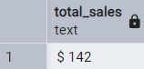

#### Add cheese is $1 extra
```sql

WITH pizza_count AS (
SELECT pizza_name, COUNT(*) AS pizza_count
FROM runner_orders
JOIN customer_orders
USING (order_id)
JOIN pizza_names
USING (pizza_id)
WHERE pickup_time IS NOT NULL
GROUP BY pizza_name
),
extras_count AS (
SELECT pizza_name, COUNT(extras) AS extras_count
FROM customer_orders
JOIN pizza_names 
USING (pizza_id)
WHERE extras IS NOT NULL
GROUP BY pizza_name
),
extras_table AS (
SELECT *, UNNEST(STRING_TO_ARRAY(extras, ','))::INTEGER AS extras_id
FROM customer_orders
WHERE extras IS NOT NULL
),
extra_cheese AS (
SELECT pizza_name, topping_name, COUNT(topping_name) AS cheese_count
FROM extras_table
JOIN pizza_toppings
ON topping_id = extras_id
JOIN pizza_names
USING (pizza_id)
WHERE topping_name = 'Cheese'
GROUP BY topping_name, pizza_name
),
pizza_sum AS (
SELECT
  pc.pizza_name,
  pc.pizza_count,
  ec.extras_count,
  cheese_count,
  CASE
    WHEN pc.pizza_name = 'Meat Lovers' THEN pc.pizza_count * 12
    WHEN pc.pizza_name = 'Vegetarian' THEN pc.pizza_count * 10
    ELSE NULL
  END AS pizza_sales
FROM pizza_count pc
LEFT JOIN extras_count ec ON pc.pizza_name = ec.pizza_name
LEFT JOIN extra_cheese ON pc.pizza_name = extra_cheese.pizza_name
)
SELECT '$ ' || SUM(pizza_sales) + SUM(extras_count) + SUM(cheese_count) AS total_sales
FROM pizza_sum;

```
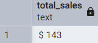
***
#### 3. The Pizza Runner team now wants to add an additional ratings system that allows customers to rate their runner, how would you design an additional table for this new dataset - generate a schema for this new table and insert your own data for ratings for each successful customer order between 1 to 5.
```sql

-- create schema for runner ratings
DROP SCHEMA IF EXISTS pizza_runner_rating;
CREATE SCHEMA pizza_runner_rating;
SET search_path = pizza_runner_rating;

DROP TABLE IF EXISTS runner_ratings;
CREATE TABLE runner_ratings (
	"runner_id" INTEGER,
	"runner_rating" INTEGER,
	"order_id" INTEGER,
	"duration" INTEGER
);

INSERT INTO runner_ratings (
	"runner_id", "order_id", "duration", "runner_rating"
)
SELECT runner_id, order_id, duration,
CASE 
	WHEN duration <= 15 THEN 5
	WHEN duration > 15 AND duration <= 20 THEN 4
	WHEN duration > 20 AND duration <= 25 THEN 3
	WHEN duration > 25 AND duration <= 30 THEN 2
	WHEN duration > 31 THEN 1
	ELSE NULL
END AS runner_rating
FROM pizza_runner.runner_orders;

SET search_path = pizza_runner_rating;

SELECT *
FROM runner_ratings;

```
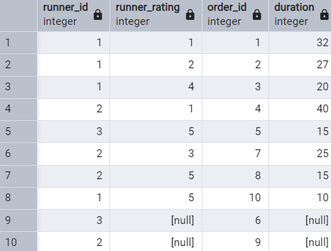
***
#### 4. Using your newly generated table - can you join all of the information together to form a table which has the following information for successful deliveries?
- customer_id
- order_id
- runner_id
- rating
- order_time
- pickup_time
- Time between order and pickup
- Delivery duration
- Average speed
- Total number of pizzas
```sql

SET search_path = pizza_runner;
WITH all_orders AS (
SELECT co.customer_id AS customer_id, 
	   co.order_id AS order_id, 
	   ro.runner_id AS runner_id, 
	   runner_rating, 
	   order_time, 
	   pickup_time, 
	   ROUND(EXTRACT(EPOCH FROM (pickup_time::TIMESTAMP - order_time))/60, 2) AS prep_time,
	   ro.duration AS duration,
	   ROUND(distance * 60/ro.duration, 2) AS speed  --speed = (km/hr)(distance/duration) || duration = min(1hr/60min)
FROM runner_ratings 
JOIN pizza_runner.runner_orders ro
USING (order_id)
JOIN pizza_runner.customer_orders co
USING (order_id)
WHERE pickup_time IS NOT NULL
)
SELECT *, COUNT (*) AS pizza_count
FROM all_orders
GROUP BY customer_id, 
	   order_id, 
	   runner_id, 
	   runner_rating, 
	   order_time, 
	   pickup_time,
	   duration,
	   prep_time,
	   all_orders.speed;

```
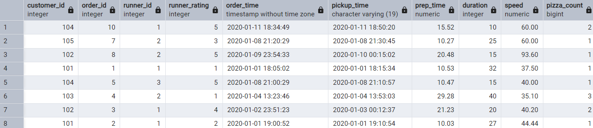
***
#### 5. If a Meat Lovers pizza was $12 and Vegetarian $10 fixed prices with no cost for extras and each runner is paid $0.30 per kilometre traveled - how much money does Pizza Runner have left over after these deliveries?
```sql

SELECT '$ ' || SUM(pizza_sales) AS total_sales
FROM(SELECT pizza_name,
CASE
	WHEN pizza_name = 'Meat Lovers' THEN pizza_count * 12 - (total_distance * 0.3)
	WHEN pizza_name = 'Vegetarian' THEN pizza_count * 10 - (total_distance * 0.3)
	ELSE NULL
END AS pizza_sales
FROM (
SELECT pizza_name, SUM(distance) AS total_distance, COUNT(*) AS pizza_count
FROM runner_orders
JOIN customer_orders
USING (order_id)
JOIN pizza_names
USING (pizza_id)
WHERE pickup_time IS NOT NULL
GROUP BY pizza_name
));

```
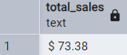
