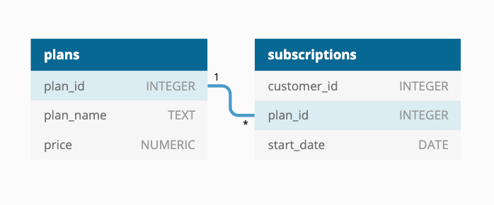

# Case Study #3 - Foodie-Fi 🥑
Reference: [8 Week SQL Challenge - Foodie-Fi](https://8weeksqlchallenge.com/case-study-3/)
***
## Introduction
Subscription based businesses are super popular and Danny realised that there was a large gap in the market - he wanted to create a new streaming service that only had food related content - something like Netflix but with only cooking shows!

Danny finds a few smart friends to launch his new startup Foodie-Fi in 2020 and started selling monthly and annual subscriptions, giving their customers unlimited on-demand access to exclusive food videos from around the world!

Danny created Foodie-Fi with a data driven mindset and wanted to ensure all future investment decisions and new features were decided using data. This case study focuses on using subscription style digital data to answer important business questions.
***
## Available Data
Danny has shared the data design for Foodie-Fi and also short descriptions on each of the database tables - our case study focuses on only 2 tables but there will be a challenge to create a new table for the Foodie-Fi team.

All datasets exist within the foodie_fi database schema - be sure to include this reference within your SQL scripts as you start exploring the data and answering the case study questions.
***
### Entity Relationship Diagram

***
## Case Study Questions
This case study is split into an initial data understanding question before diving straight into data analysis questions before finishing with 1 single extension challenge.
## A. Customer Journey
#### Based off the 8 sample customers provided in the sample from the subscriptions table, write a brief description about each customer’s onboarding journey.

#### Try to keep it as short as possible - you may also want to run some sort of join to make your explanations a bit easier!

```sql

SELECT *
FROM subscriptions
JOIN plans
USING (plan_id)
WHERE customer_id IN (1, 2, 11, 13, 15, 16, 18 ,19);

```
#### From the eight sample customers provided in the subscriptions table, all of them subscribed to a trial before choosing another plan. Only two customers from the sample did not continue their subscription.

***
## B. Data Analysis Questions
#### 1. How many customers has Foodie-Fi ever had?
```sql

SELECT SUM(customer_count) AS total_costumers
FROM (
SELECT COUNT (DISTINCT customer_id) AS customer_count, plan_id, plan_name
FROM subscriptions
JOIN plans
USING (plan_id)
WHERE plan_id <> 4
GROUP BY plan_id, plan_name
);

```

***
#### 2. What is the monthly distribution of trial plan start_date values for our dataset - use the start of the month as the group by value
```sql

DROP VIEW IF EXISTS customer_subs;
CREATE VIEW customer_subs AS
SELECT *
FROM subscriptions
JOIN plans
USING (plan_id);

SELECT 
	EXTRACT(MONTH FROM start_date) AS month_num, 
	TO_CHAR(start_date, 'Month') AS month, 
	COUNT(*) AS trial_subs
FROM customer_subs
WHERE plan_id = 0
GROUP BY EXTRACT(MONTH FROM start_date), TO_CHAR(start_date, 'Month')
ORDER BY month_num ASC;

```

***
#### 3. What plan start_date values occur after the year 2020 for our dataset? Show the breakdown by count of events for each plan_name
```sql

SELECT plan_name, COUNT(*) AS plan_breakdown
FROM customer_subs
WHERE start_date > '2020-12-31'
GROUP BY plan_name
ORDER BY COUNT(*) ASC;

```

***
#### 4. What is the customer count and percentage of customers who have churned rounded to 1 decimal place?
```sql

SELECT COUNT(*) AS churn_count,
	   ROUND(100.0 * COUNT(*) / (SELECT COUNT(DISTINCT customer_id) FROM customer_subs), 1) AS churn_perc
FROM customer_subs
WHERE plan_name = 'churn';

```

***
#### 5. How many customers have churned straight after their initial free trial - what percentage is this rounded to the nearest whole number?
```sql

WITH next_sub AS (
SELECT *, LEAD(plan_name) OVER(PARTITION BY customer_id ORDER BY start_date) AS next_plan
FROM customer_subs
)
SELECT 
	COUNT(*) as churn_subs_count, 
	ROUND(100 * COUNT(*) / (SELECT COUNT(DISTINCT customer_id) FROM customer_subs), 0) AS churn_subs_perc
FROM next_sub
WHERE plan_name = 'trial' AND next_plan = 'churn';

```

***
#### 6. What is the number and percentage of customer plans after their initial free trial?
```sql

WITH customer_count AS (
SELECT *, 
	LEAD(plan_name) OVER(PARTITION BY customer_id ORDER BY start_date) AS next_plan
FROM customer_subs
)
SELECT 
	COUNT(*) as customer_subs_count, 
	ROUND(100 * COUNT(*) / (SELECT COUNT(DISTINCT customer_id) FROM customer_subs), 0) AS customer_subs_perc
FROM customer_count
WHERE plan_name = 'trial' AND next_plan <> 'churn';

```

***
#### 7. What is the customer count and percentage breakdown of all 5 plan_name values at 2020-12-31?
```sql

WITH next_sub_date AS (
SELECT *, 
	LEAD(start_date) OVER(PARTITION BY customer_id ORDER BY start_date) AS next_date
FROM customer_subs
WHERE start_date <= '2020-12-31'
)
SELECT plan_id, 
	COUNT(customer_id) AS subs_count, 
	ROUND(100.0 * COUNT(customer_id) / (SELECT COUNT(customer_id) FROM next_sub_date WHERE next_date IS NULL), 1) AS subs_count_perc
FROM next_sub_date
WHERE next_date IS NULL
GROUP BY plan_id;

```

***
#### 8. How many customers have upgraded to an annual plan in 2020?
```sql

SELECT COUNT(customer_id) AS pro_annual_subs
FROM customer_subs
WHERE plan_name = 'pro annual' AND start_date <= '2020-12-31';

```

***
#### 9. How many days on average does it take for a customer to an annual plan from the day they join Foodie-Fi?
```sql

WITH trial_sub AS (
SELECT customer_id, start_date AS trial_date
FROM customer_subs
WHERE plan_name = 'trial'
),
annual_sub AS (
SELECT customer_id, start_date AS annual_plan_date
FROM customer_subs
WHERE plan_name = 'pro annual'
)
SELECT ROUND(AVG(annual_plan_date - trial_date), 2) AS avg_days
FROM trial_sub ts
JOIN annual_sub
USING (customer_id);

```

***
#### 10. Can you further breakdown this average value into 30 day periods (i.e. 0-30 days, 31-60 days etc)
```sql

WITH trial_sub AS (
SELECT customer_id, start_date AS trial_date
FROM customer_subs
WHERE plan_name = 'trial'
),
annual_sub AS (
SELECT customer_id, start_date AS annual_plan_date
FROM customer_subs
WHERE plan_name = 'pro annual'
),
bin AS (
SELECT
	WIDTH_BUCKET(annual_plan_date - trial_date, 0, 365, 12) AS days_to_upgrade
FROM trial_sub
JOIN annual_sub
USING (customer_id)
)
SELECT
CASE
	WHEN days_to_upgrade - 1 = 0 THEN (days_to_upgrade - 1	) * 30 || ' - ' || days_to_upgrade * 30
	ELSE (days_to_upgrade - 1) * 30 + 1 || ' - ' || days_to_upgrade * 30
END AS bucket_day_period,
COUNT(*) AS customer_count
FROM bin
GROUP BY days_to_upgrade
ORDER BY days_to_upgrade;

```

***
#### 11. How many customers downgraded from a pro monthly to a basic monthly plan in 2020?
```sql

WITH annual_subs AS (
SELECT *, LEAD(plan_name) OVER(PARTITION BY customer_id ORDER BY start_date) AS next_plan
FROM customer_subs
WHERE start_date <= '2020-12-31'
)
SELECT COUNT(customer_id) AS downgrade_subs
FROM annual_subs
WHERE plan_name = 'pro monthly' AND next_plan = 'basic monthly'

```

