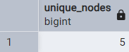
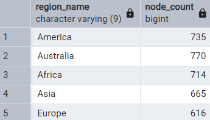
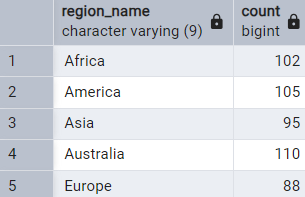
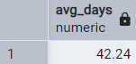
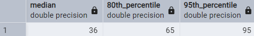
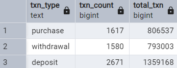
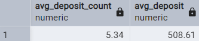
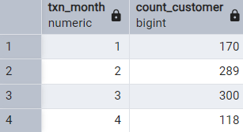

# Case Study #4 - Data Bank 🪙
Reference: [8 Week SQL Challenge - Data Bank](https://8weeksqlchallenge.com/case-study-4/)
***
## Introduction
There is a new innovation in the financial industry called Neo-Banks: new aged digital only banks without physical branches.

Danny thought that there should be some sort of intersection between these new age banks, cryptocurrency and the data world…so he decides to launch a new initiative - Data Bank!

Data Bank runs just like any other digital bank - but it isn’t only for banking activities, they also have the world’s most secure distributed data storage platform!

Customers are allocated cloud data storage limits which are directly linked to how much money they have in their accounts. There are a few interesting caveats that go with this business model, and this is where the Data Bank team need your help!

The management team at Data Bank want to increase their total customer base - but also need some help tracking just how much data storage their customers will need.

This case study is all about calculating metrics, growth and helping the business analyse their data in a smart way to better forecast and plan for their future developments!
***
## Available Data
The Data Bank team have prepared a data model for this case study as well as a few example rows from the complete dataset below to get you familiar with their tables.
***
### Entity Relationship Diagram

***
## Case Study Questions
The following case study questions include some general data exploration analysis for the nodes and transactions before diving right into the core business questions and finishes with a challenging final request!
## A. Customer Nodes Exploration
#### 1. How many unique nodes are there on the Data Bank system?
```sql

SELECT COUNT(DISTINCT node_id) AS unique_nodes
FROM customer_nodes;

```

***
#### 2. What is the number of nodes per region?
```sql

DROP VIEW IF EXISTS customer_regions;
CREATE VIEW customer_regions AS
SELECT *
FROM customer_nodes
JOIN regions
USING (region_id);

SELECT region_name, 
	COUNT(node_id) AS node_count
FROM customer_regions
GROUP BY region_name;

```

***
#### 3. How many customers are allocated to each region?
```sql

SELECT region_name, 
	COUNT(DISTINCT customer_id)
FROM customer_regions
GROUP BY region_name;

```

***
#### 4. How many days on average are customers reallocated to a different node?
```sql

WITH node_days AS (
SELECT customer_id, 
	start_date,
	LEAD(start_date) OVER(PARTITION BY customer_id ORDER BY node_id) AS next_date,
	node_id, 
	LEAD(node_id) OVER(PARTITION BY customer_id ORDER BY node_id) AS next_node
FROM customer_regions
ORDER BY customer_id, node_id, start_date, next_date
),
reallocate_days AS (
SELECT *, 
	ABS(next_date - start_date) AS days_to_reallocate
FROM node_days
WHERE next_node = node_id + 1
)
SELECT ROUND(AVG(days_to_reallocate), 2) AS avg_days
FROM reallocate_days;

```

***
#### 5. What is the median, 80th and 95th percentile for this same reallocation days metric for each region?
```sql

WITH node_days AS (
SELECT customer_id, 
	start_date,
	LEAD(start_date) OVER(PARTITION BY customer_id ORDER BY node_id) AS next_date,
	node_id, 
	LEAD(node_id) OVER(PARTITION BY customer_id ORDER BY node_id) AS next_node
FROM customer_regions
ORDER BY customer_id, node_id, start_date, next_date
),
reallocate_days AS (
SELECT *, 
	ABS(next_date - start_date) AS days_to_reallocate
FROM node_days
WHERE next_node = node_id + 1
)
SELECT
	percentile_cont(0.5) WITHIN GROUP (ORDER BY days_to_reallocate) AS median,
	percentile_cont(0.8) WITHIN GROUP (ORDER BY days_to_reallocate) AS "80th_percentile",
	percentile_cont(0.95) WITHIN GROUP (ORDER BY days_to_reallocate) AS "95th_percentile"
FROM reallocate_days;

```

***
## B. Customer Nodes Exploration
#### 1. What is the unique count and total amount for each transaction type?
```sql

SELECT txn_type::TEXT, 
	COUNT(customer_id) AS txn_count, 
	SUM(txn_amount) AS total_txn
FROM customer_transactions
GROUP BY txn_type;

```

***
#### 2. What is the average total historical deposit counts and amounts for all customers?
```sql

WITH deposit_txn AS (
SELECT
	COUNT(customer_id) AS txn_count,
	AVG(txn_amount) AS avg_deposit
FROM customer_transactions
WHERE txn_type = 'deposit'
GROUP BY customer_id
)
SELECT
	ROUND(AVG(txn_count), 2) AS avg_deposit_count,
	ROUND(AVG(avg_deposit), 2) AS avg_deposit
FROM deposit_txn;

```

***
#### 3. For each month - how many Data Bank customers make more than 1 deposit and either 1 purchase or 1 withdrawal in a single month?
```sql

WITH monthly_txn AS (
SELECT customer_id, 
	EXTRACT(MONTH FROM txn_date) AS txn_month,
	SUM(CASE WHEN txn_type = 'deposit' THEN 0 ELSE 1 END) AS count_deposit,
	SUM(CASE WHEN txn_type = 'purhcase' THEN 0 ELSE 1 END) AS count_purchase,
	SUM(CASE WHEN txn_type = 'withdrawal' THEN 1 ELSE 0 END) AS count_withdraw
FROM customer_transactions
GROUP BY customer_id, EXTRACT(MONTH FROM txn_date)
)
SELECT txn_month, 
	COUNT(DISTINCT customer_id) AS count_customer
FROM monthly_txn
WHERE count_deposit > 1
	AND (count_purchase >= 1 OR count_withdraw >= 1)
GROUP BY txn_month
ORDER BY txn_month;

```

***
