# Case Study #5 - Data Mart 🛒
Reference: [8 Week SQL Challenge - Data Mart](https://8weeksqlchallenge.com/case-study-5/)
## Introduction
Data Mart is Danny’s latest venture and after running international operations for his online supermarket that specialises in fresh produce - Danny is asking for your support to analyse his sales performance.

In June 2020 - large scale supply changes were made at Data Mart. All Data Mart products now use sustainable packaging methods in every single step from the farm all the way to the customer.

Danny needs your help to quantify the impact of this change on the sales performance for Data Mart and it’s separate business areas.

The key business question he wants you to help him answer are the following:

- What was the quantifiable impact of the changes introduced in June 2020?
- Which platform, region, segment and customer types were the most impacted by this change?
- What can we do about future introduction of similar sustainability updates to the business to minimise impact on sales?
***
## Available Data
For this case study there is only a single table: data_mart.weekly_sales

The Entity Relationship Diagram is shown below with the data types made clear, please note that there is only this one table - hence why it looks a little bit lonely!
***
### Entity Relationship Diagram

***
## Column Dictionary
The columns are pretty self-explanatory based on the column names but here are some further details about the dataset:

- Data Mart has international operations using a multi-region strategy
- Data Mart has both, a retail and online platform in the form of a Shopify store front to serve their customers
- Customer segment and customer_type data relates to personal age and demographics information that is shared with Data Mart
- transactions is the count of unique purchases made through Data Mart and sales is the actual dollar amount of purchases
  
Each record in the dataset is related to a specific aggregated slice of the underlying sales data rolled up into a week_date value which represents the start of the sales week.
***
## Case Study Questions
## A. Data Cleansing Steps
#### In a single query, perform the following operations and generate a new table in the data_mart schema named clean_weekly_sales:
- Convert the week_date to a DATE format
- Add a week_number as the second column for each week_date value, for example any value from the 1st of January to 7th of January will be 1, 8th to 14th will be 2 etc
- Add a month_number with the calendar month for each week_date value as the 3rd column
- Add a calendar_year column as the 4th column containing either 2018, 2019 or 2020 values
- Add a new column called age_band after the original segment column using the following mapping on the number inside the segment value
```sql

DROP TABLE IF EXISTS clean_weekly_sales;
CREATE TABLE clean_weekly_sales AS
SELECT 
	TO_DATE(week_date, 'DD/MM/YY') AS new_date,
	EXTRACT(WEEK FROM TO_DATE(week_date, 'DD/MM/YY')) AS week_number,
	EXTRACT(MONTH FROM TO_DATE(week_date, 'DD/MM/YY')) AS month_number,
	EXTRACT(YEAR FROM TO_DATE(week_date, 'DD/MM/YY')) AS calendar_year,
	region,
	platform,
	segment,
	CASE
		WHEN RIGHT(segment, 1) = '1' THEN 'Young Adults'
		WHEN RIGHT(segment, 1) = '2' THEN 'Middle Aged'
		WHEN RIGHT(segment, 1) = '3' OR RIGHT(segment, 1) = '4' THEN 'Retirees'
		ELSE 'unknown'
	END AS age_band,
	CASE
		WHEN LEFT(segment, 1) = 'C' THEN 'Couples'
		WHEN LEFT(segment, 1) = 'F' THEN 'Families'
		ELSE 'unknown'
	END AS demographic_band,
	transactions,
	ROUND((sales::NUMERIC/transactions), 2) AS avg_transaction,
	sales
FROM weekly_sales;

SELECT *
FROM clean_weekly_sales;

```
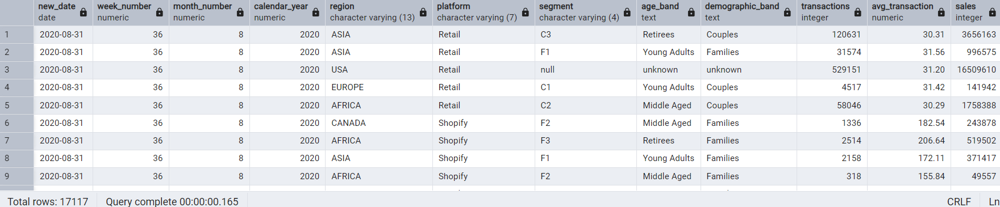
***
## B. Data Exploration
#### 1. What day of the week is used for each week_date value?
```sql

SELECT 
	DISTINCT(TO_CHAR(new_date, 'FMDay')) AS day_of_week
FROM clean_weekly_sales;

```

***
#### 2. What range of week numbers are missing from the dataset?
```sql

WITH week_range AS (
SELECT
	GENERATE_SERIES(1, 52) AS week_number
)
SELECT DISTINCT wr.week_number AS missing_week
FROM week_range wr
LEFT JOIN clean_weekly_sales cws
USING (week_number)
WHERE cws.week_number IS NULL;

```
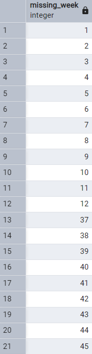
***
#### 3. How many total transactions were there for each year in the dataset?
```sql

SELECT calendar_year, SUM(transactions) AS total_transactions
FROM clean_weekly_sales
GROUP BY calendar_year;

```
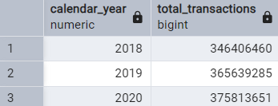
***
#### 4. What is the total sales for each region for each month?
```sql

SELECT region, month_number, SUM(sales)
FROM clean_weekly_sales
GROUP BY region, month_number
ORDER BY month_number, region;

```
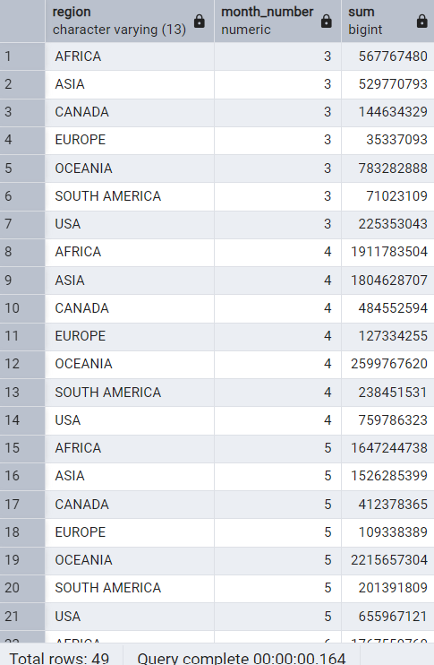
***
#### 5. What is the total count of transactions for each platform
```sql

SELECT platform, COUNT(transactions) AS total_count_txn
FROM clean_weekly_sales
GROUP BY platform;

```
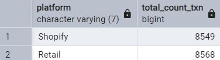
***
#### 6. What is the percentage of sales for Retail vs Shopify for each month?
```sql

WITH platform_sales AS (
SELECT platform, month_number, SUM(sales) AS total_sales
FROM clean_weekly_sales
GROUP BY platform, month_number
)
SELECT month_number,
	ROUND(100 * MAX(CASE
		WHEN platform = 'Retail' THEN total_sales ELSE NULL END)/ SUM(total_sales), 2) AS retail_perc,
	ROUND(100 * MAX(CASE
		WHEN platform = 'Shopify' THEN total_sales ELSE NULL END)/ SUM(total_sales), 2) AS shopify_perc
FROM platform_sales
GROUP BY month_number;

```
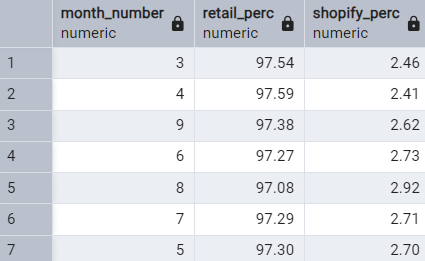
***
#### 7. What is the percentage of sales by demographic for each year in the dataset?
```sql

WITH demog_sales AS (
SELECT demographic_band, calendar_year, SUM(sales) AS total_sales
FROM clean_weekly_sales
GROUP BY demographic_band, calendar_year
)
SELECT calendar_year,
	ROUND(100 * MAX(CASE
			WHEN demographic_band = 'Couples' THEN total_sales ELSE NULL END)/SUM(total_sales), 2) AS couples_perc,
	ROUND(100 * MAX(CASE
			WHEN demographic_band = 'Families' THEN total_sales ELSE NULL END)/SUM(total_sales), 2) AS families_perc,
	ROUND(100 * MAX(CASE
			WHEN demographic_band = 'unknown' THEN total_sales ELSE NULL END)/SUM(total_sales), 2) AS unknown_perc		
FROM demog_sales
GROUP BY calendar_year;

```
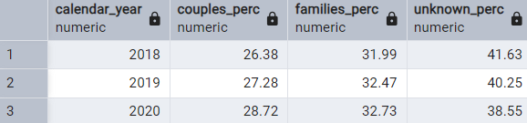
***
#### 8. Which age_band and demographic values contribute the most to Retail sales?
```sql

SELECT age_band, demographic_band, 
	SUM(sales) AS retail_sales,
	ROUND(100 * SUM(sales)/SUM(SUM(sales)) OVER (), 2) AS contrib_perc
FROM clean_weekly_sales
WHERE platform = 'Retail'
GROUP BY age_band, demographic_band
ORDER BY retail_sales DESC;

```
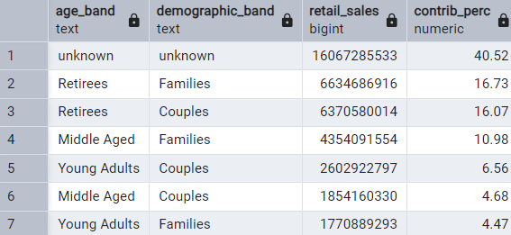
***
#### 9. Can we use the avg_transaction column to find the average transaction size for each year for Retail vs Shopify? If not - how would you calculate it instead?
```sql

SELECT calendar_year, platform, 
	ROUND(AVG(avg_transaction), 2) AS avg_transaction_column,
	SUM(sales)/SUM(transactions) AS avg_transaction_new
FROM clean_weekly_sales
GROUP BY calendar_year, platform;

```
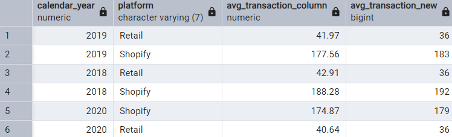
***
## C. Before & After Analysis
This technique is usually used when we inspect an important event and want to inspect the impact before and after a certain point in time.

Taking the week_date value of 2020-06-15 as the baseline week where the Data Mart sustainable packaging changes came into effect.

We would include all week_date values for 2020-06-15 as the start of the period after the change and the previous week_date values would be before

Using this analysis approach - answer the following questions:
#### 1. What is the total sales for the 4 weeks before and after 2020-06-15? What is the growth or reduction rate in actual values and percentage of sales?
```sql

SELECT week_number
FROM clean_weekly_sales
WHERE new_date = '2020-06-15';

WITH week AS (
SELECT week_number, SUM(sales) AS total_sales
FROM clean_weekly_sales
WHERE (week_number BETWEEN 21 AND 28) AND (calendar_year = 2020)
GROUP BY week_number
),
sales_before_after AS (
SELECT 
	SUM(CASE WHEN week_number BETWEEN 21 AND 24 THEN total_sales END) AS weeks_before,
	SUM(CASE WHEN week_number BETWEEN 25 AND 28 THEN total_sales END) AS weeks_after
FROM week
)
SELECT 
	weeks_after - weeks_before AS reduction_rate,
	ROUND(100 * (weeks_after - weeks_before)/weeks_before, 2) AS perc_sales
FROM sales_before_after;

```
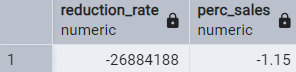
***
#### 2. What about the entire 12 weeks before and after?
```sql

SELECT week_number
FROM clean_weekly_sales
WHERE new_date = '2020-06-15';

WITH week AS (
SELECT week_number, SUM(sales) AS total_sales
FROM clean_weekly_sales
WHERE (week_number BETWEEN 21 - 8 AND 28 + 8) AND (calendar_year = 2020)
GROUP BY week_number
),
sales_before_after AS (
SELECT 
	SUM(CASE WHEN week_number BETWEEN 21 - 8 AND 24 THEN total_sales END) AS weeks_before,
	SUM(CASE WHEN week_number BETWEEN 25 AND 28 + 8 THEN total_sales END) AS weeks_after
FROM week
)
SELECT 
	weeks_after - weeks_before AS reduction_rate,
	ROUND(100 * (weeks_after - weeks_before)/weeks_before, 2) AS perc_sales
FROM sales_before_after;

```
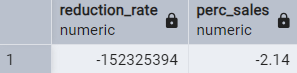
***
#### 3. How do the sale metrics for these 2 periods before and after compare with the previous years in 2018 and 2019?
#### 4 weeks before and after
```sql

SELECT week_number
FROM clean_weekly_sales
WHERE new_date = '2020-06-15';

WITH week AS (
SELECT calendar_year, week_number, SUM(sales) AS total_sales
FROM clean_weekly_sales
WHERE week_number BETWEEN 21 AND 28
GROUP BY calendar_year, week_number
),
sales_before_after AS (
SELECT calendar_year,
	SUM(CASE WHEN week_number BETWEEN 21 AND 24 THEN total_sales END) AS weeks_before,
	SUM(CASE WHEN week_number BETWEEN 25 AND 28 THEN total_sales END) AS weeks_after
FROM week
GROUP BY calendar_year
)
SELECT calendar_year,
	weeks_after - weeks_before AS sales_diff,
	ROUND(100 * (weeks_after - weeks_before)/weeks_before, 2) AS perc_sales
FROM sales_before_after;

```
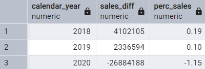
***
#### 12 weeks before and after
```sql

WITH week AS (
SELECT calendar_year, week_number, SUM(sales) AS total_sales
FROM clean_weekly_sales
WHERE week_number BETWEEN 21 - 8 AND 28 + 8
GROUP BY calendar_year, week_number
),
sales_before_after AS (
SELECT calendar_year,
	SUM(CASE WHEN week_number BETWEEN 21 - 8 AND 24 THEN total_sales END) AS weeks_before,
	SUM(CASE WHEN week_number BETWEEN 25 AND 28 + 8 THEN total_sales END) AS weeks_after
FROM week
GROUP BY calendar_year
)
SELECT calendar_year,
	weeks_after - weeks_before AS sales_diff,
	ROUND(100 * (weeks_after - weeks_before)/weeks_before, 2) AS perc_sales
FROM sales_before_after;

```
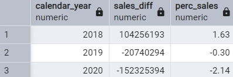
