# Case Study #7 - Balanced Tree Clothing Co. 🥼
Reference: [8 Week SQL Challenge - Balanced Tree Clothing Co.](https://8weeksqlchallenge.com/case-study-7/)
***
## Introduction
Balanced Tree Clothing Company prides themselves on providing an optimised range of clothing and lifestyle wear for the modern adventurer!

Danny, the CEO of this trendy fashion company has asked you to assist the team’s merchandising teams analyse their sales performance and generate a basic financial report to share with the wider business.
***
## Available Data
For this case study there is a total of 4 datasets for this case study - however you will only need to utilise 2 main tables to solve all of the regular questions, and the additional 2 tables are used only for the bonus challenge question!
***
## Case Study Questions
The following questions can be considered key business questions and metrics that the Balanced Tree team requires for their monthly reports.

Each question can be answered using a single query - but as you are writing the SQL to solve each individual problem, keep in mind how you would generate all of these metrics in a single SQL script which the Balanced Tree team can run each month.
## A. High Level Sales Analysis
#### 1. What was the total quantity sold for all products?
```sql

SELECT SUM(qty) AS total_qty_sold
FROM sales;

```
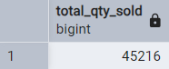
***
#### 2. What is the total generated revenue for all products before discounts?
```sql

SELECT SUM(qty) * SUM(price) AS total_revenue
FROM sales;

```
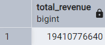
***
#### 3. What was the total discount amount for all products?
```sql

SELECT SUM(discount) AS total_discount
FROM sales;

```
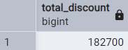
***
## B. Transaction Analysis
#### 1. How many unique transactions were there?
```sql

SELECT 
	COUNT(DISTINCT txn_id) AS unique_transactions
FROM sales;

```
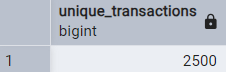
***
#### 2. What is the average unique products purchased in each transaction?
```sql

WITH product_count AS (
SELECT txn_id, 
	COUNT(DISTINCT prod_id) AS unique_product
FROM sales
GROUP BY txn_id
)
SELECT 
	ROUND(AVG(unique_product)) AS avg_unique_product
FROM product_count;

```
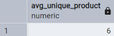
***
#### 3. What are the 25th, 50th and 75th percentile values for the revenue per transaction?
```sql

WITH revenue_per_txn AS (
SELECT txn_id, 
	SUM(price * qty) AS revenue
FROM sales
GROUP BY txn_id
)
SELECT
	PERCENTILE_CONT(0.25) WITHIN GROUP (ORDER BY revenue) AS "25th_perc",
	PERCENTILE_CONT(0.5) WITHIN GROUP (ORDER BY revenue) AS "50th_perc",
	PERCENTILE_CONT(0.75) WITHIN GROUP (ORDER BY revenue) AS "75th_perc"
FROM revenue_per_txn;

```
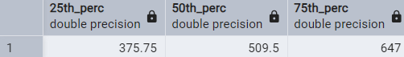
***
#### 4. What is the average discount value per transaction?
```sql

WITH txn_discount AS (
SELECT txn_id,
	SUM(qty * price * (discount/100.00)) AS discount_per_txn
FROM sales
GROUP BY txn_id
)
SELECT ROUND(AVG(discount_per_txn), 2) AS avg_discount
FROM txn_discount;

```
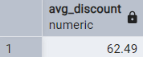
***
#### 5. What is the percentage split of all transactions for members vs non-members?
```sql

WITH membership AS (
SELECT member, 
	COUNT(txn_id) AS all_txn
FROM sales
GROUP BY member
)
SELECT member,
	ROUND(100 * all_txn/SUM(all_txn) OVER(), 2) AS perc_split
FROM membership
GROUP BY member, all_txn;

```
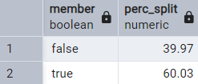
***
#### 6. What is the average revenue for member transactions and non-member transactions?
```sql

WITH member_revenue AS (
SELECT member, txn_id, 
	SUM(qty * price) AS total_revenue
FROM sales
GROUP BY member, txn_id
)
SELECT member, 
	ROUND(AVG(total_revenue), 2) AS avg_revenue
FROM member_revenue
GROUP BY member;

```
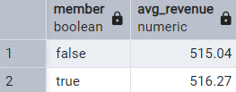
***
## C. Product Analysis
#### 1. What are the top 3 products by total revenue before discount?
```sql

SELECT product_name, 
	SUM(qty * s.price) AS total_revenue
FROM sales s
JOIN product_details
ON prod_id = product_id
GROUP BY product_name
ORDER BY total_revenue DESC
LIMIT 3;

```
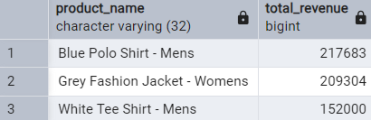
***
#### 2. What is the total quantity, revenue and discount for each segment?
```sql

SELECT segment_name, 
	SUM(qty) AS total_qty,
	SUM(qty * s.price) AS total_revenue,
	SUM((qty * s.price) * discount/100) AS total_discount
FROM sales s
JOIN product_details
ON prod_id = product_id
GROUP BY segment_name;

```
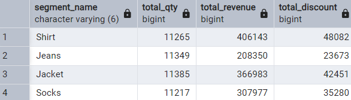
***
#### 3. What is the top selling product for each segment?
```sql

WITH product_sold AS (
SELECT segment_name, product_name,
	RANK() OVER(PARTITION BY segment_name ORDER BY SUM(qty) DESC) AS rank_product,
	SUM(qty) AS total_qty
FROM sales s
JOIN product_details
ON prod_id = product_id
GROUP BY segment_name, product_name
)
SELECT segment_name, product_name, total_qty
FROM product_sold
WHERE rank_product = 1;

```
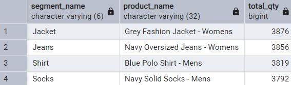
***
#### 4. What is the total quantity, revenue and discount for each category?
```sql

SELECT category_name,
	SUM(qty) AS total_qty,
	SUM(qty * s.price) AS total_revenue,
	SUM((qty * s.price) * discount/100) AS total_discount
FROM sales s
JOIN product_details
ON prod_id = product_id
GROUP BY category_name;

```
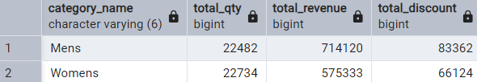
***
#### 5. What is the top selling product for each category?
```sql

WITH category_rank AS (
SELECT category_name, product_name,
	SUM(qty) AS total_qty,
	RANK() OVER(PARTITION BY category_name ORDER BY SUM(qty) DESC) AS product_rank
FROM sales s
JOIN product_details
ON prod_id = product_id
GROUP BY category_name, product_name
)
SELECT category_name, product_name, total_qty
FROM category_rank
WHERE product_rank = 1;

```
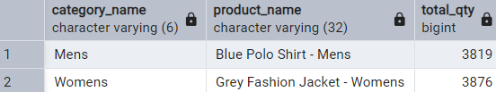
***
#### 6. What is the percentage split of revenue by product for each segment?
```sql

WITH product_split AS (
SELECT product_name, 
	SUM(qty * s.price) AS total_revenue
FROM sales s
JOIN product_details
ON prod_id = product_id
GROUP BY product_name
)
SELECT product_name,
	ROUND(100 * total_revenue/SUM(total_revenue) OVER(), 2) AS perc_split
FROM product_split
ORDER BY perc_split DESC;

```
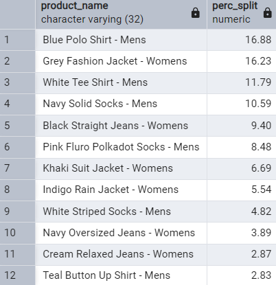
***
#### 7. What is the percentage split of revenue by segment for each category?
```sql

WITH segment_split AS (
SELECT segment_name, 
	SUM(qty * s.price) AS total_revenue
FROM sales s
JOIN product_details
ON prod_id = product_id
GROUP BY segment_name
)
SELECT segment_name,
	ROUND(100 * total_revenue/SUM(total_revenue) OVER(), 2) AS perc_split
FROM segment_split
ORDER BY perc_split DESC;

```
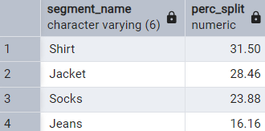
***
#### 8. What is the percentage split of total revenue by category?
```sql

WITH category_split AS (
SELECT category_name, 
	SUM(qty * s.price) AS total_revenue
FROM sales s
JOIN product_details
ON prod_id = product_id
GROUP BY category_name
)
SELECT category_name,
	ROUND(100 * total_revenue/SUM(total_revenue) OVER(), 2) AS perc_split
FROM category_split
ORDER BY perc_split DESC;

```
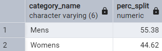
***
#### 9. What is the total transaction “penetration” for each product? (hint: penetration = number of transactions where at least 1 quantity of a product was purchased divided by total number of transactions)
```sql

WITH total_txn AS (
SELECT 
	COUNT(DISTINCT txn_id) AS total_txns
FROM sales
),
txn_pen AS (
SELECT product_name, 
	COUNT(DISTINCT txn_id) AS txn_count
FROM sales s
JOIN product_details
ON prod_id = product_id
GROUP BY product_name
)
SELECT product_name,
	ROUND(100 * txn_count / total_txns, 2) AS product_pen
FROM txn_pen
CROSS JOIN total_txn;

```
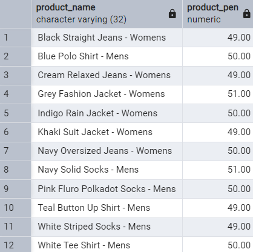
***
#### 10. What is the most common combination of at least 1 quantity of any 3 products in a 1 single transaction?
```sql

WITH products_combi AS (
SELECT txn_id,
	STRING_AGG(product_name, ', ' ORDER BY product_name) AS products,
	COUNT(DISTINCT s.prod_id) AS product_count
FROM sales s
JOIN product_details
ON prod_id = product_id
WHERE qty >= 1
GROUP BY txn_id
),
product_rank AS (
SELECT products,
	COUNT(*) AS txn_count,
	DENSE_RANK() OVER(ORDER BY COUNT(*) DESC) AS combi_rank
FROM products_combi
WHERE product_count = 3
GROUP BY products
ORDER BY txn_count DESC
)
SELECT products
FROM product_rank
WHERE combi_rank = 1

```
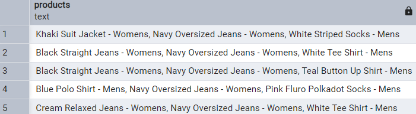

