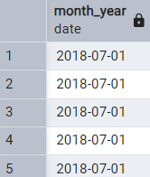
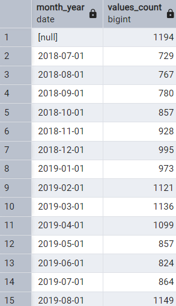
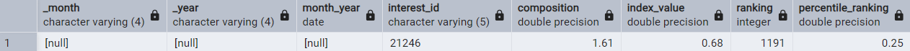
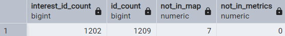
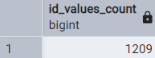
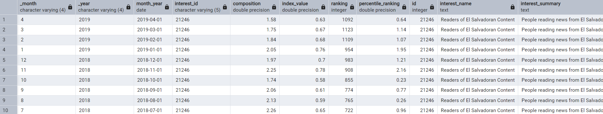
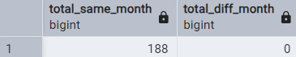
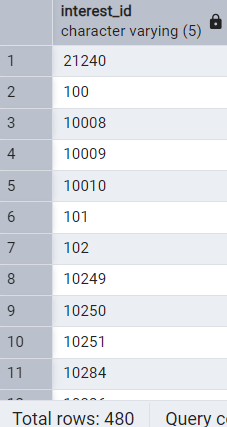
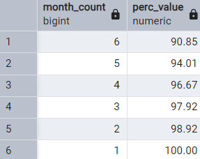
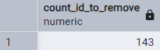

# Case Study #8 - Fresh Segments 🍊
Reference: [8 Week SQL Challenge - Fresh Segments](https://8weeksqlchallenge.com/case-study-8/)
***
## Introduction
Danny created Fresh Segments, a digital marketing agency that helps other businesses analyse trends in online ad click behaviour for their unique customer base.

Clients share their customer lists with the Fresh Segments team who then aggregate interest metrics and generate a single dataset worth of metrics for further analysis.

In particular - the composition and rankings for different interests are provided for each client showing the proportion of their customer list who interacted with online assets related to each interest for each month.

Danny has asked for your assistance to analyse aggregated metrics for an example client and provide some high level insights about the customer list and their interests.
***
## Available Data
For this case study there is a total of 2 datasets which you will need to use to solve the questions.
***
## Case Study Questions
The following questions can be considered key business questions that are required to be answered for the Fresh Segments team.

Most questions can be answered using a single query however some questions are more open ended and require additional thought and not just a coded solution!
## A. Data Exploration and Cleansing
#### 1. Update the fresh_segments.interest_metrics table by modifying the month_year column to be a date data type with the start of the month
```sql

ALTER TABLE interest_metrics
ALTER COLUMN month_year TYPE DATE
USING TO_DATE(month_year, 'MM-YY');

SELECT month_year
FROM interest_metrics
LIMIT 5;

```

***
#### 2. What is count of records in the fresh_segments.interest_metrics for each month_year value sorted in chronological order (earliest to latest) with the null values appearing first?
```sql

SELECT month_year,
	COUNT(*) AS values_count
FROM interest_metrics
GROUP BY month_year
ORDER BY month_year ASC NULLS FIRST;

```

***
#### 3. What do you think we should do with these null values in the fresh_segments.interest_metrics
```sql

SELECT *
FROM interest_metrics
WHERE month_year IS NULL;

-- Drop all null values except for 1 in interest_id that has a value

DELETE FROM interest_metrics
WHERE interest_id IS NULL;

SELECT *
FROM interest_metrics
WHERE month_year IS NULL;

```

***
#### 4. How many interest_id values exist in the fresh_segments.interest_metrics table but not in the fresh_segments.interest_map table? What about the other way around?
```sql

WITH id_counts AS (
SELECT imet.interest_id, imap.id,
CASE WHEN imet.interest_id IS NULL THEN COUNT(imap.id) ELSE 0 END AS not_in_map,
CASE WHEN imap.id IS NULL THEN COUNT(imet.interest_id) ELSE 0 END AS not_in_metrics
FROM interest_metrics imet
FULL JOIN interest_map imap
ON imet.interest_id::INTEGER = imap.id
GROUP BY id, interest_id
)
SELECT 
	COUNT(interest_id) AS interest_id_count,
	COUNT(id) AS id_count,
	SUM(not_in_map) AS not_in_map,
	SUM(not_in_metrics) AS not_in_metrics
FROM id_counts;

```

***
#### 5. Summarise the id values in the fresh_segments.interest_map by its total record count in this table
```sql

SELECT COUNT(*) AS id_values_count
FROM interest_map;

```

***
#### 6. What sort of table join should we perform for our analysis and why? Check your logic by checking the rows where interest_id = 21246 in your joined output and include all columns from fresh_segments.interest_metrics and all columns from fresh_segments.interest_map except from the id column.
```sql

SELECT *
FROM interest_metrics
JOIN interest_map
ON id = interest_id::integer
WHERE interest_id = '21246'
	  AND month_year IS NOT NULL;

```

***
#### 7. Are there any records in your joined table where the month_year value is before the created_at value from the fresh_segments.interest_map table? Do you think these values are valid and why?
```sql

WITH metrics_map AS (
SELECT *
FROM interest_metrics
JOIN interest_map
ON id = interest_id::integer
),
validation AS (
SELECT _month, 
	   _year, 
	   month_year, 
	   created_at, 
	   EXTRACT(MONTH FROM created_at) AS created_month,
	   EXTRACT(YEAR FROM created_at) AS created_year
FROM metrics_map
WHERE month_year < created_at
),
month_count AS (
SELECT
CASE WHEN _month::integer = created_month THEN 1 ELSE 0 END AS same_month_count,
CASE WHEN _month::integer <> created_month THEN 1 ELSE 0 END AS diff_month_count
FROM validation
)
SELECT
	SUM(same_month_count) AS total_same_month,
	SUM(diff_month_count) AS total_diff_month
FROM month_count;

-- The values are valid since all of them are created in the same month. The month_year column was altered and was set to first day of every month as default which is why when compared to created_at column, complete datetime, there are month_year values that are less than from the created_at values.

```

***
## B. Interest Analysis
#### 1. Which interests have been present in all month_year dates in our dataset?
```sql

WITH interest_count AS (
SELECT interest_id, 
	COUNT(DISTINCT month_year) AS month_year_count
FROM interest_metrics
GROUP BY interest_id
ORDER BY month_year_count DESC
)
SELECT interest_id
FROM interest_count
WHERE 
	month_year_count = (SELECT MAX(month_year_count) FROM interest_count);

```

***
#### 2. Using this same total_months measure - calculate the cumulative percentage of all records starting at 14 months - which total_months value passes the 90% cumulative percentage value?
```sql

WITH distinct_month AS (
SELECT interest_id,
	COUNT(DISTINCT month_year) AS month_count
FROM interest_metrics
WHERE interest_id IS NOT NULL
GROUP BY interest_id
),
distinct_interest AS (
SELECT interest_id, month_count,
	COUNT(DISTINCT interest_id) AS interest_count
FROM distinct_month
GROUP BY month_count, interest_id
),
cumulative_perc AS (
SELECT interest_id, month_count, interest_count,
	ROUND(100 * SUM(interest_count) OVER(ORDER BY month_count DESC) / SUM(interest_count) OVER(), 2) AS perc_value
FROM distinct_interest
)
SELECT month_count, perc_value
FROM cumulative_perc
WHERE perc_value > 90;

```

***
#### 3. If we were to remove all interest_id values which are lower than the total_months value we found in the previous question - how many total data points would we be removing?
```sql

WITH distinct_month AS (
SELECT interest_id,
	COUNT(DISTINCT month_year) AS month_count
FROM interest_metrics
WHERE interest_id IS NOT NULL
GROUP BY interest_id
),
distinct_interest AS (
SELECT interest_id, month_count,
	COUNT(DISTINCT interest_id) AS interest_count
FROM distinct_month
GROUP BY month_count, interest_id
),
cumulative_perc AS (
SELECT interest_id, month_count, interest_count,
	ROUND(100 * SUM(interest_count) OVER(ORDER BY month_count DESC) / SUM(interest_count) OVER(), 2) AS perc_value
FROM distinct_interest
),
id_to_remove AS (
SELECT month_count, perc_value, COUNT(interest_id) AS interest_id_count
FROM cumulative_perc
WHERE perc_value > 90
GROUP BY month_count, perc_value
)
SELECT 
	SUM(interest_id_count) AS count_id_to_remove
FROM id_to_remove;

```

